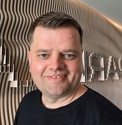

  
  

    <h2 style="margin-top: 0;">Lev Pasichnyi</h2>
    
DevOps Engineer · Business Consulting · Solution Architecture

    
<i>Uzhhorod, Ukraine</i> · <a href="mailto:lev.pa@levarc.com">contact@levarc.com</a>

  

## 🚀 About LevArc

I'm Lev Pasichnyi — a DevOps engineer and strategic consultant based in Uzhhorod, Ukraine. I specialize in bridging the gap
between technology and business, delivering scalable infrastructure and automation solutions that drive innovation and growth.

With over 15 years of experience across enterprise DevOps, cloud architecture, and business consulting, I’ve led cross-functional
teams and implemented turnkey infrastructure that improves operational efficiency and accelerates market impact.

## 🛠️ Technical Expertise

- Azure & AWS Clouds
- Kubernetes · GitOps · Terraform
- GitHub Actions · Azure DevOps · Bash & Python automation
- PostgreSQL · MongoDB · Cosmos DB · MS SQL
- Cloud migration · Mobile app delivery · Hybrid infrastructure

## 💡 Philosophy

I bring a customer-centric mindset to every engagement — designing solutions that foster trust, increase revenue, and scale with
precision. Whether it’s cloud migration, mobile app delivery, or hybrid infrastructure, I deliver reproducible, branded systems
that support long-term growth.

## 📬 Connect

- LinkedIn: [linkedin.com](https://www.linkedin.com/in/levpa)
- Portfolio: [github.com](https://github.com/levpa)
