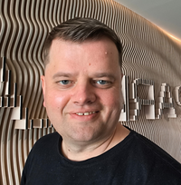

  
  

    <h2 style="margin-top: 0;">Lev Pasichnyi</h2>
    
DevOps Engineer · Business Consulting

  

## 🚀 About LevArc

I'm Lev Pasichnyi — a DevOps engineer and cloud consultant based in Uzhhorod, Ukraine. I specialize in bridging the gap
between technology and business, delivering scalable infrastructure and automation solutions that drive innovation and growth.

With over 15 years of experience across enterprise DevOps, cloud architecture, and business consulting, I’ve led
cross-functional teams and implemented turnkey infrastructure that improves operational efficiency and accelerates market impact.

I also lead a local team of DevOps engineers who can be engaged on-demand for larger or parallel projects — enabling
rapid scaling and delivery without compromising quality.

---

## 🧩 Qualifications

Over the past 11 years, I’ve worked on hybrid infrastructure projects that span both on-premises data centers and cloud
platforms. More than half of my experience has been in large enterprise environments where security, compliance,
and reliability are paramount — collaborating directly with decision-makers and specialized teams.

---

## 🏆 Accomplishments

- Mentored junior developers and DevOps engineers across multiple teams
- Collaborated with security teams to resolve incidents and successfully prevent a company breach
- Worked alongside renowned DevOps professionals and teams from PayPal, Wolters Kluwer, and Victor Farcic
- Completed advanced training in Docker, Kubernetes, Terraform, and MongoDB during personal development time

---

## 🛠️ Technical Expertise

- **Cloud Platforms**: Azure, AWS
- **Infrastructure as Code**: Terraform, Bicep
- **Containerization & Orchestration**: Docker, Kubernetes, ArgoCD, Flux
- **CI/CD Pipelines**: GitHub Actions, Azure DevOps, GitLab
- **Automation**: Bash, PowerShell, Python
- **Databases**: PostgreSQL, MongoDB, Cosmos DB, MySQL
- **Delivery**: Mobile apps deployments, hybrid cloud migration, enterprise-grade architecture

---

## 💡 Philosophy

I bring a customer-centric mindset to every engagement — designing solutions that foster trust, increase revenue, and scale
with precision. Whether it’s cloud migration, mobile app delivery, or hybrid infrastructure, I deliver reproducible, branded
systems that support long-term growth.

---

If you'd like to collaborate, explore a consulting engagement, or discuss a project, feel free to [reach out](/contact)
